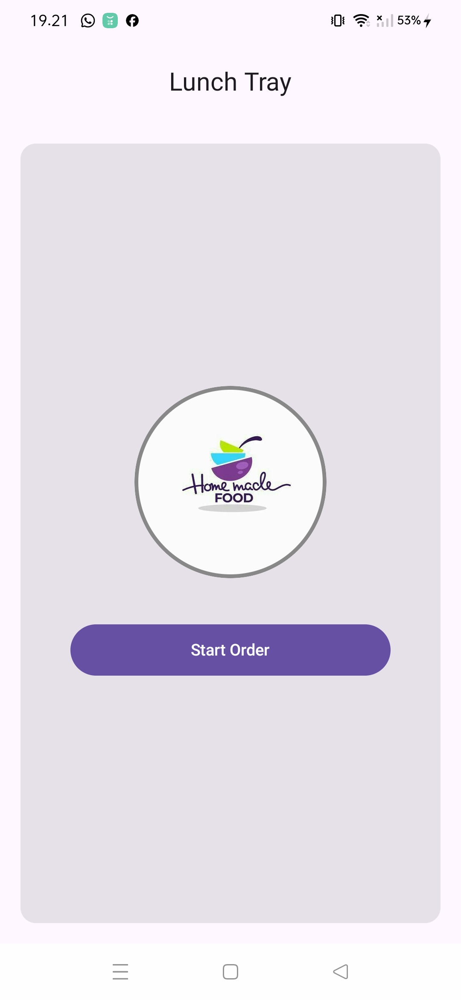
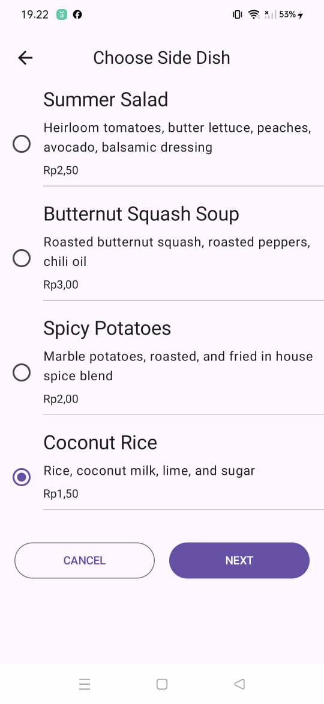
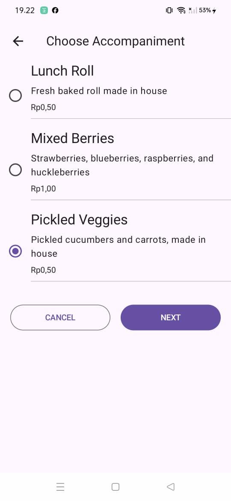

# PRACTICE LUNCH TRAY
# PRACTICE MOBILE_PNM_3D

# Practice Lunch Tray

Proyek ini merupakan latihan implementasi UI Desain serta penambahan animasi pada column atau card di sebuah aplikasi mobile. Menambahkan ViewModel() pada sebuah aplikasi untuk menyimpan UI state, logo launcher apps serta implementasi StateFlow yang menampilkan pembaruan status pada Logcat. Aplikasi ini mengimpelemntasikan penggunaan tombol navigasi, pada setiap layar UI Screen, sehingga di setiap screen memiliki fungsi masing - masing di setiap file.kt.
Aplikasi ini dibuat dengan tujuan untuk mempelajari dasar-dasar Kotlin lanjutan berdasarkan kursus pada Android Developer(**Kotlin pada Android Studio**).  

---

## Fitur
-  Menampilkan beberapa jenis makan siang.
-  Implementasi Data Class, UI Desain, Animasi, Tata Letak, ViewModel(), pembaruan status pada StateFlow, dan penambahan Button Navigation ( tombol navigasi ).
-  Memiliki beberapa pilihan menu di antaranya, Hidangan utama, tambahan menu Lauk, dan tambahan iringan atau acompaniment, serta menampilkan ringkasan pesanan.
- Menampilkan ringkasan pesanan yang menampilkan makanan yang di pilih serta total harga sesuai dengan pesanan.
---
## Tech

- [Android Studio] - IDE resmi untuk pengembangan aplikasi Android
- [Kotlin] - bahasa pemrograman modern untuk Android, ringkas & aman
- [XML] - untuk membuat layout antarmuka pengguna
- [Android Jetpack] - kumpulan library pendukung pengembangan Android
- [Material Design Components] - komponen UI dengan desain modern dari Google
- [Gradle] - sistem build otomatis untuk Android Studio

## Preview
Berikut Tampilan Lunch Tray Apps

## Plugins

| Plugin | README |
| ------ | ------ |
| Dropbox | [plugins/dropbox/README.md][PlDb] |
| GitHub | [plugins/github/README.md][PlGh] |
| Google Drive | [plugins/googledrive/README.md][PlGd] |
| OneDrive | [plugins/onedrive/README.md][PlOd] |
| Medium | [plugins/medium/README.md][PlMe] |
| Google Analytics | [plugins/googleanalytics/README.md][PlGa] |

## Development
- Mobile Development (IDE)

## License

D3 TEKNOLOGI INFORMASI
POLITEKNIK NEGERI MADIUN

**Free Software, Hell Yeah!**

[//]: # (These are reference links used in the body of this note and get stripped out when the markdown processor does its job. There is no need to format nicely because it shouldn't be seen. Thanks SO - http://stackoverflow.com/questions/4823468/store-comments-in-markdown-syntax)

   [dill]: <https://github.com/joemccann/dillinger>
   [git-repo-url]: <https://github.com/joemccann/dillinger.git>
   [john gruber]: <http://daringfireball.net>
   [df1]: <http://daringfireball.net/projects/markdown/>
   [markdown-it]: <https://github.com/markdown-it/markdown-it>
   [Ace Editor]: <http://ace.ajax.org>
   [node.js]: <http://nodejs.org>
   [Twitter Bootstrap]: <http://twitter.github.com/bootstrap/>
   [jQuery]: <http://jquery.com>
   [@tjholowaychuk]: <http://twitter.com/tjholowaychuk>
   [express]: <http://expressjs.com>
   [AngularJS]: <http://angularjs.org>
   [Gulp]: <http://gulpjs.com>

   [PlDb]: <https://github.com/joemccann/dillinger/tree/master/plugins/dropbox/README.md>
   [PlGh]: <https://github.com/joemccann/dillinger/tree/master/plugins/github/README.md>
   [PlGd]: <https://github.com/joemccann/dillinger/tree/master/plugins/googledrive/README.md>
   [PlOd]: <https://github.com/joemccann/dillinger/tree/master/plugins/onedrive/README.md>
   [PlMe]: <https://github.com/joemccann/dillinger/tree/master/plugins/medium/README.md>
   [PlGa]: <https://github.com/RahulHP/dillinger/blob/master/plugins/googleanalytics/README.md>

